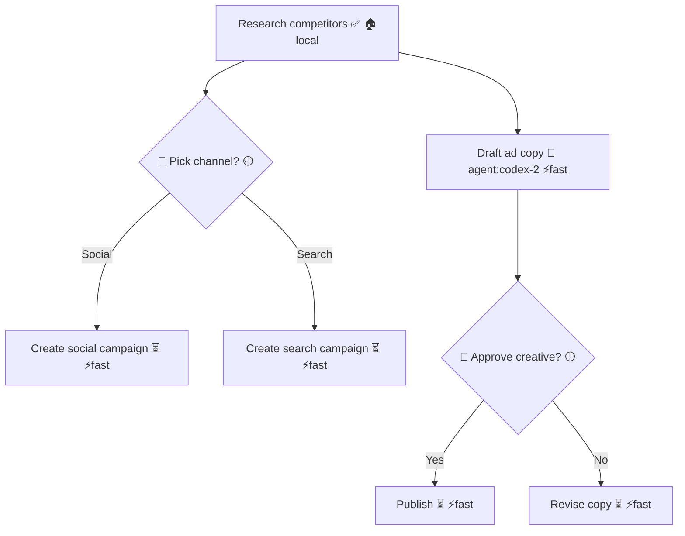

# merdag — Build Spec (Codex-Ready)

This is the **distilled spec sheet** to hand directly to Codex CLI or Claude Code. No discussion, no context — just what to build.

---

## Ralph Loop Protocol

This spec is designed to be executed in a **Ralph Loop** — an autonomous iteration pattern where the AI agent runs in a fresh context window each iteration, picks the next task, executes it, commits, and repeats.

**Key rules for the agent:**

1. **Re-read this spec and `progress.md` at the start of every iteration.** Do not rely on conversation memory.
2. **If `progress.md` shows a partially completed stage, finish the remaining checklist items in that SAME stage before advancing.** Do not skip ahead just because some boxes are already checked.
3. **Maintain `progress.md` in the repo root** — this is your memory between iterations. After completing any checklist item, update `progress.md` immediately before committing.
4. **One stage per iteration.** Complete the current stage fully (all checklist items + "Done when" verification), update `progress.md`, commit, then stop. The next iteration picks up the next stage.
5. **Git is your memory layer.** Commit after every meaningful change with message format: `merdag: Stage N — <what was done>`
6. **If a stage's "Done when" check fails**, fix it in the same iteration before moving on.
7. **COMPLETION signal:** When ALL stages (0-5) are complete and the final acceptance criteria pass, output exactly `<promise>COMPLETE</promise>` as the last line of your response. The Ralph loop script checks for this token to exit.
8. **Feedback loops (Stage 2+ ONLY — skip entirely during Stage 0 and Stage 1):** Before committing, run these sanity checks. Do NOT commit if any fail — fix first:

```bash
pip install -e . 2>&1 | tail -5          # must succeed
merdag --help                              # must print help
python -m merdag --help                    # must print help
python -c "from merdag.parser import Node, Edge, Plan; print('OK')"  # must print OK
```

**Environment note for this repo:** The loop runs on Windows PowerShell. Before any `python` or `pip` command, activate the virtual environment with `.\.venv\Scripts\Activate.ps1`. If you switch to `cmd.exe`, use `.venv\Scripts\activate` there. When creating directories from PowerShell, use `New-Item -ItemType Directory -Force` instead of `mkdir -p`.

**Rule 9 — `AGENTS.md` as persistent knowledge base:** Create `AGENTS.md` in the repo root at the start of Stage 1. After each iteration, append discoveries, gotchas, and patterns to it. Sections:

- **Patterns & Conventions:** How the codebase is structured
- **Gotchas:** Things that caused failures (e.g., "emoji regex needs no special flags in Python 3")
- **Decisions:** Why certain approaches were chosen
- Keep entries brief and factual — 1 line per item

**Rule 10 — Cross-model review (optional):** If using multiple agents (Codex CLI primary, Claude Code backup), the reviewing agent should read the git diff from the last iteration and check for: correctness, missed checklist items, and regressions. The reviewer does NOT commit — it only appends feedback to `AGENTS.md` under a `## Review Feedback` section. The next worker iteration reads this feedback before starting.

### `progress.md` format

```markdown
# merdag — Build Progress

## Stage 1: File Convention
- [x] examples/plan.mermaid
- [x] examples/decisions.md
- [x] SKILL.md
- [x] README.md
- **Status:** ✅ Complete
- **Verified:** All "Done when" checks pass

## Stage 2: CLI — Agent Interface
- [x] parser.py data structures
- [x] merdag init
- [ ] merdag next
- ...
- **Status:** 🔄 In Progress
```

*Create this file at the start of Stage 1. Update it after every completed item.*

### `AGENTS.md` format

```markdown
# merdag — Agent Knowledge Base

## Patterns & Conventions
- CLI entry point is `merdag/cli.py`, uses click
- All commands output JSON by default, `--human` for pretty print
- File locking via `filelock` package on every write

## Gotchas
- Python 3 handles emoji natively in regex — no special flags needed
- Mermaid lines can define nodes AND edges on same line — parser must handle
- Do NOT use `mermaid.init()` for re-rendering — use `mermaid.render()` with new ID

## Decisions
- Chose `filelock` over `fcntl.flock` for cross-platform support
- Static template for `merdag init` (not LLM-generated) to avoid API dependency in Stage 2

## Review Feedback
- (appended by reviewer agent between iterations)
```

*Create at the start of Stage 1. Append after every iteration.*

---

## Project: merdag

A CLI tool that uses a shared `.mermaid` file as a living execution plan for agent fleets. Agents read, execute, and update tasks. Different model tiers handle different types of work.

**Hackathon Track:** Statement 1 — Codex-Powered Services

---

## File Convention

### `plan.mermaid`

A standard Mermaid flowchart file. All agents read and write it. It is the execution graph AND the model routing layer.

**Node syntax:**

```
[Task name ✅]              → completed
[Task name 🔄 agent:name]  → in progress by named agent
[Task name ⏳]              → waiting for dependencies
[Task name ❌]              → failed
{🧑 Decision label 🟡}     → human decision (waits for human)
{🤖 Decision label 🟡}     → agent decision (Codex decides)
```

**Model tier tags (appended to node text):**

```
🏠local  → local model (privacy-sensitive tasks)
⚡fast   → GPT-4o-mini (cheap execution)
🤖codex  → OpenAI Codex (decisions, planning)
🧑human  → human input required
```

**Supported Mermaid shapes (ONLY these):**

```jsx
graph TD           → top-down flowchart (the only graph type we parse)
A[Label]           → rectangle (task nodes)
B{Label}           → diamond (decision nodes)
A --> B            → edge (dependency)
A -->|Label| B     → labeled edge (decision branch)
%% comment         → Mermaid comment (used for metadata)
```

Do NOT parse or generate subgraphs, styles, class definitions, or any other Mermaid syntax. Only `graph TD`, rectangles `[]`, diamonds `{}`, edges `-->`, and labeled edges `-->|label|`.

**IMPORTANT — Mermaid lines can define nodes AND edges on the same line:**

```jsx
A[Research competitors ✅ 🏠local] --> B{🤖 Pick channel? 🟡}
```

This single line defines node A, node B, AND an edge A→B. The parser MUST handle this. See Stage 2 parser logic for details.

**IMPORTANT — Decision branch routing:**

When a decision node is resolved with a choice (e.g., "Social"), only the matching branch proceeds. All other branches and their downstream nodes should be marked `❌` (skipped). Example:

- Decision B resolved with "Social"
- Edge `B -->|Social| D` → D becomes available (⏳)
- Edge `B -->|Search| E` → E gets marked ❌ (skipped)
- Any nodes downstream of E also get marked ❌ recursively

**Example `plan.mermaid`:**



### `decisions.md`

Append-only file. Orchestrator appends decisions as they arise. Human can optionally fill in `Override` field. If no override, the default executes.

**Format per decision:**

```markdown
## Decision: <label> (node <ID>)
**Type:** 🤖 Agent decision | 🧑 Human decision
**Context:** <why this decision exists>
**Default (🤖 codex):** <Codex's recommended choice>
**Override:** ___
```

---

## Tech Stack

- **Language:** Python 3.11+
- **CLI framework:** `click`
- **File locking:** `filelock` (cross-platform)
- **LLM calls:** `openai` Python package
- **Orchestrator model:** W&B Inference (via `WANDB_API_KEY`)
- **Executor model:** W&B Inference (via same key)
- **Web viewer:** Single HTML file with Mermaid.js
- **Package:** pip-installable via `pyproject.toml`

---

## Build Stages

Complete each stage fully before moving to the next. Each stage must work independently. All CLI output defaults to **JSON**. Add `--human` flag for pretty-printed output.

**Ralph Loop reminder:** At the start of each iteration, read `progress.md` to determine where you left off. After completing each checklist item below, check it off in `progress.md` and commit.

**PowerShell reminder:** This repo runs on Windows PowerShell. Activate the virtual environment with `.\.venv\Scripts\Activate.ps1` before any Python or pip command. If `progress.md` shows a stage is already partially complete, finish that same stage before starting the next one.

### Stage 0: Environment Bootstrap (10 min)

Set up the project from scratch. Assume **nothing** is pre-installed except Python 3.11+ and git.

- [ ]  **Initialize git repo:**

```bash
mkdir merdag && cd merdag
git init
```

- [ ]  **Create virtual environment and activate it:**

```bash
python3 -m venv .venv
source .venv/bin/activate      # WSL/Linux/macOS
.\.venv\Scripts\Activate.ps1 # Windows PowerShell
.venv\Scripts\activate        # Windows CMD
```

Always activate the virtual environment before any `python`, `pip`, or `merdag` command.

- [ ]  **Create minimal `pyproject.toml` so `pip install -e .` works from Stage 2 onward:**

```toml
[build-system]
requires = ["setuptools>=68.0", "wheel"]
build-backend = "setuptools.backends._legacy:_Backend"

[project]
name = "merdag"
version = "0.1.0"
description = "Shared Mermaid execution plan for agent fleets"
requires-python = ">=3.11"
dependencies = [
    "click",
    "openai",
    "filelock",
]

[project.scripts]
merdag = "merdag.cli:main"
```

- [ ]  **Create package directory with empty `__init__.py`:**

```bash
mkdir -p merdag examples templates tests                                      # WSL/Linux/macOS
New-Item -ItemType Directory -Force -Path merdag, examples, templates, tests | Out-Null  # Windows PowerShell
touch merdag/__init__.py                                                      # WSL/Linux/macOS
New-Item -ItemType File -Force -Path merdag\__init__.py | Out-Null           # Windows PowerShell
```

- [ ]  **Create `.gitignore`:**

```
__pycache__/
*.pyc
*.egg-info/
dist/
build/
.venv/
*.lock
!merdag/**
plan.mermaid
decisions.md
.eggs/
```

- [ ]  **Create `progress.md` (your memory file):**

```markdown
# merdag — Build Progress

## Stage 0: Environment Bootstrap
- [x] git init
- [x] virtual environment
- [x] pyproject.toml
- [x] package directory
- [x] .gitignore
- [x] progress.md
- **Status:** ✅ Complete
```

- [ ]  **Initial commit:**

```bash
git add -A
git commit -m "merdag: Stage 0 — environment bootstrap"
```

**Done when:** `python3 -c "import sys; assert sys.version_info >= (3, 11)"` passes. `.venv/` exists. `pyproject.toml` exists. `.gitignore` exists. `merdag/__init__.py` exists. `git log` shows initial commit.

**IMPORTANT:** Do NOT run `pip install -e .` yet — it will fail because `merdag/cli.py` doesn't exist. That happens in Stage 2.

### Stage 1: File Convention (30 min)

Create these files in the repo root:

- [ ]  **`examples/plan.mermaid`** — sample plan demonstrating ALL node conventions and ALL model tier tags. Use the marketing campaign scenario. Must be valid Mermaid syntax that renders in any Mermaid viewer. Must contain:
    - At least 8 nodes
    - At least 1 node of each status: ✅, 🔄, ⏳, ❌
    - At least 1 🧑 human decision and 1 🤖 agent decision
    - At least 1 node for each tier: 🏠local, ⚡fast, 🤖codex, 🧑human
    - Labeled edges on decision branches (e.g., `-->|Yes|`, `-->|No|`)
    - At least 2 Mermaid comments (`%%`) showing metadata (e.g., `%% result: ...`)
- [ ]  **`examples/decisions.md`** — sample decision queue with exactly 3 decisions:
    1. One `🤖 Agent decision` that has been resolved (Override filled in)
    2. One `🤖 Agent decision` that is pending (Override blank)
    3. One `🧑 Human decision` that is pending (Override blank)
    - Each decision must have: Type, Context (1-2 sentences), Default, Override fields
- [ ]  **`SKILL.md`** — AgentSkills-compatible spec. Must include:
    - YAML frontmatter: `name: merdag`, `version: 0.1.0`, `description: "Shared Mermaid execution plan for agent fleets"`, `tags: [orchestration, planning, mermaid, multi-agent]`
    - Body sections: "What is merdag", "File Convention", "Node Syntax", "Model Tiers", "CLI Commands", "How to use as an agent"
    - The "How to use as an agent" section must give a step-by-step for an agent joining a fleet: read plan → call `merdag next` → execute task → call `merdag done` → repeat
- [ ]  **`AGENTS.md`** — agent knowledge base (see format above). Initialize with the Patterns & Conventions and Gotchas sections pre-filled from this spec.
- [ ]  **`README.md`** — must include:
    - One-liner description
    - "Why" section: existing tools use JSON configs or custom protocols; merdag uses a Mermaid file that's readable by humans AND machines
    - "How it works" with the two-file system diagram
    - "Quick start" with install + 5-command example
    - "Node conventions" reference table
    - "Model tier tags" reference table
    - "CLI commands" reference with all commands
    - "For agents" section pointing to [SKILL.md](http://SKILL.md)

**Done when:** All 5 files exist (including `AGENTS.md`). `examples/plan.mermaid` renders correctly when pasted into [mermaid.live](http://mermaid.live). README has all sections listed above.

### Stage 2: CLI — Agent Interface (1 hr)

Create a Python CLI package `merdag` using `click`. All commands output JSON by default. All commands accept `--human` flag for pretty output.

**Core data structures in `parser.py`:**

```python
@dataclass
class Node:
    id: str              # e.g. "A"
    label: str           # e.g. "Research competitors"
    status: str          # "done" | "in_progress" | "waiting" | "failed" | "pending_decision"
    tier: str | None     # "local" | "fast" | "codex" | "human" | None
    node_type: str       # "task" | "decision"
    decision_type: str | None  # "🧑" | "🤖" | None
    agent: str | None    # e.g. "codex-2" from 🔄 agent:codex-2

@dataclass
class Edge:
    source: str          # node id
    target: str          # node id
    label: str | None    # e.g. "Yes", "Social"

@dataclass
class Plan:
    nodes: dict[str, Node]   # id -> Node
    edges: list[Edge]
    comments: list[str]      # %% lines
    raw: str                 # original file content
```

**Parser logic (`parser.py`):**

- Read `plan.mermaid` as text
- Line 1 must be `graph TD` (skip if present)
- **A single line can contain node definitions AND edges.** Parse each line by:
    1. First, extract ALL node definitions from the line using regex:
        - Task node: `([A-Za-z0-9_]+)\[(.+?)\]` → captures id and label
        - Decision node: `([A-Za-z0-9_]+)\{(.+?)\}` → captures id and label
    2. Then, extract edge from the line:
        - Labeled edge: `([A-Za-z0-9_]+)\s*-->\|(.+?)\|\s*([A-Za-z0-9_]+)` → source, label, target
        - Plain edge: `([A-Za-z0-9_]+)\s*-->\s*([A-Za-z0-9_]+)` → source, target
    3. Comment: `^\s*%%\s*(.+)$`
- **A node may appear on multiple lines** (once as definition, again in an edge). Only store the node once — first definition wins.
- Parse label text to extract status emoji, tier emoji, agent name, decision type using these patterns:
    - Status: search for ✅ (done), 🔄 (in_progress), ⏳ (waiting), ❌ (failed), 🟡 (pending_decision)
    - Tier: search for 🏠 (local), ⚡ (fast), 🤖 (codex), 🧑 (human)
    - Agent: regex `agent:(\S+)`
    - Decision type: if node_type is decision, check for 🧑 or 🤖 at start of label
- **Use Python's `re` module with default flags** — Python 3 handles Unicode/emoji natively, no special flags needed.
- **Root nodes** (nodes with no incoming edges) are immediately available if their status is ⏳.

**Updater logic (`updater.py`):**

- To update a node: read file, find the line containing the node ID, replace the label with new status/emoji, write file back
- Use the `filelock` package (cross-platform) for file locking on every write to `plan.mermaid` and `decisions.md`. Do NOT use `fcntl.flock` (Unix-only, breaks on Windows).
- Lock pattern:

```python
from filelock import FileLock

def write_locked(path: str, new_content: str):
    lock = FileLock(f"{path}.lock")
    with lock:
        with open(path, 'w') as f:
            f.write(new_content)

def read_locked(path: str) -> str:
    lock = FileLock(f"{path}.lock")
    with lock:
        with open(path, 'r') as f:
            return f.read()
```

**Commands:**

- [ ]  **`merdag init "<task description>"`**
    - Creates `plan.mermaid` with a hardcoded marketing campaign template (copy from `examples/plan.mermaid` but reset all statuses to ⏳)
    - Adds `%% task: <task description>` as first line after `graph TD`
    - Creates empty `decisions.md` with header: `# Decisions for: <task description>`
    - Output: `{"created": ["plan.mermaid", "decisions.md"]}`
- [ ]  **`merdag next` (optional: `--tier <tier>`)**
    - Parse plan. For each node, check if ALL upstream dependencies (via edges) have status `done`.
    - If `--tier` is given, filter to nodes matching that tier. If not given, return ALL available tasks across all tiers.
    - Only return nodes with status `waiting` or `pending_decision` whose deps are met.
    - Output: `[{"id": "D", "label": "Create social campaign", "tier": "fast", "type": "task"}]`
    - If no tasks available: `[]`
- [ ]  **`merdag done <node_id> --result "<description>"`**
    - Find node by ID. Replace status emoji with ✅. Remove any 🔄/⏳.
    - Append `%% result(<node_id>): <description>` at end of file.
    - Output: `{"node": "A", "status": "done", "result": "<description>"}`
- [ ]  **`merdag fail <node_id> --reason "<description>"`**
    - Find node by ID. Replace status emoji with ❌.
    - Append `%% failed(<node_id>): <description>` at end of file.
    - Output: `{"node": "A", "status": "failed", "reason": "<description>"}`
- [ ]  **`merdag decide <node_id> --choice "<option>" --reason "<why>"`**
    - Find decision node by ID. Replace 🟡 with ✅ in `plan.mermaid`.
    - **Branch routing:** Find all outgoing labeled edges from this decision node. The edge whose label matches `--choice` is the chosen branch. All OTHER branches: mark their target nodes and all downstream descendants as ❌ (skipped) recursively.
    - Append a new decision entry to `decisions.md` using the SAME format as the File Convention section:

```markdown
## Decision: <label> (node <ID>)
**Type:** 🤖 Agent decision | 🧑 Human decision
**Context:** <auto-generated summary or empty>
**Default (🤖 codex):** <choice>
**Override:** <choice if different from default, else ___>
```

- Output: `{"node": "B", "choice": "Social", "reason": "<why>", "skipped_nodes": ["E"]}`
- [ ]  **`merdag status`**
    - Parse plan. Count nodes by status.
    - Output:

```json
{
  "task": "Launch marketing campaign",
  "total": 8,
  "done": 2,
  "in_progress": 1,
  "waiting": 3,
  "failed": 0,
  "decisions_pending": 2,
  "nodes": [
    {"id": "A", "label": "Research competitors", "status": "done", "tier": "local", "type": "task"},
    ...
  ]
}
```

- [ ]  **`merdag decisions`**
    - Parse `decisions.md`. Find entries where Override is `___` (unresolved).
    - **Parsing logic for `decisions.py`:** Split file by lines starting with `## Decision:`. For each block, extract fields using regex:
        - Node ID: `\(node ([A-Za-z0-9_]+)\)` from the header
        - Label: text between `Decision:` and `(node` in the header
        - Type: match `🤖` or `🧑` after `**Type:**`
        - Default: text after `**Default (🤖 codex):**`
        - Override: text after `**Override:**` — if `___` or blank, it's unresolved
    - Output: `[{"node": "B", "label": "Pick channel?", "type": "🤖", "default": "Social"}]`
- [ ]  **`merdag/__main__.py`** with `from merdag.cli import main; main()`
- [ ]  **Verify package install:** `pyproject.toml` already exists from Stage 0. Run `pip install -e .` — it must succeed now that `cli.py` exists. Then verify: `merdag --help` and `python -m merdag --help` must both work.

**IMPORTANT for all file paths:** Use `pathlib.Path` or `os.path.join` for all file paths in Python code. Never hardcode `/` or `\` separators. This ensures cross-platform compatibility (WSL + Windows).

**Done when:** This exact sequence succeeds:

```bash
pip install -e .
merdag init "Launch marketing campaign"
merdag status                    # returns JSON with 8+ nodes
merdag next                      # returns all available tasks
merdag next --tier fast           # returns only fast-tier tasks
merdag done A --result "Found 5 competitors"
merdag status                    # A is now done
merdag next                      # new tasks unlocked
merdag decide B --choice "Social" --reason "Higher engagement"
merdag decisions                 # B no longer in pending list
```

### Stage 3: Codex-Powered Simulation (1 hr)

**CLI registration:** Add `simulate` as a new click command in `cli.py`. Wire it to the simulation engine in `simulate.py`.

**LLM wrapper (`llm.py`):**

```python
import openai
import os

# IMPORTANT: "codex" is NOT a real OpenAI model name.
# W&B Inference — OpenAI-compatible endpoint
CODEX_MODEL = os.getenv("MERDAG_CODEX_MODEL", "meta-llama/Llama-4-Scout-17B-16E-Instruct")
FAST_MODEL = os.getenv("MERDAG_FAST_MODEL", "meta-llama/Llama-4-Scout-17B-16E-Instruct")

def call_llm(tier: str, system_prompt: str, user_prompt: str) -> dict:
    """Returns {"response": str, "model": str, "tokens_in": int, "tokens_out": int}"""
    model = CODEX_MODEL if tier in ("codex", "human") else FAST_MODEL
    client = openai.OpenAI(
        api_key=os.environ["WANDB_API_KEY"],
        base_url="https://api.inference.wandb.ai/v1",
    )
    resp = client.chat.completions.create(
        model=model,
        messages=[
            {"role": "system", "content": system_prompt},
            {"role": "user", "content": user_prompt}
        ],
        max_tokens=1024
    )
    return {
        "response": resp.choices[0].message.content,
        "model": model,
        "tokens_in": resp.usage.prompt_tokens,
        "tokens_out": resp.usage.completion_tokens
    }
```

**Simulation engine (`simulate.py`):**

- [ ]  **Step 1: Generate plan** — Call Codex with:
    - System prompt:

```
You are merdag, an AI planner. Generate a Mermaid flowchart for the given task.
Rules:
- Use ONLY `graph TD` format
- Task nodes: [Label STATUS TIER] where STATUS is ⏳ and TIER is one of 🏠local, ⚡fast, 🤖codex, 🧑human
- Decision nodes: {EMOJI Label 🟡} where EMOJI is 🤖 (agent decides) or 🧑 (human decides)
- Edges: A --> B or A -->|Label| B
- Generate 6-12 nodes with realistic dependencies
- Include at least 1 human decision and 1 agent decision
- Assign tiers based on task complexity
Output ONLY the mermaid code, no markdown fences, no explanation.
```

- User prompt: the task description
- Write the response to `plan.mermaid`
- Create empty `decisions.md`
- [ ]  **Step 2: Execution loop** — Repeat until no tasks available:
    1. Call `merdag next` (programmatically, via `parser.py` functions — not subprocess)
    2. If no tasks and no pending decisions → done
    3. If no tasks but pending decisions → resolve decisions first
    4. For each available task/decision, call the appropriate LLM:
        
        **For `⚡fast` task nodes:**
        
        - System: `"You are a task executor. You complete tasks quickly and return a brief 1-2 sentence result describing what was done."`
        - User: `"Task: <node label>. Context: The overall plan is '<task description>'. Complete this task and describe the result."`
        - Then call `merdag done <id> --result "<llm response>"`
        
        **For `🤖codex` task nodes:**
        
        - System: `"You are a senior strategist. You analyze carefully and provide detailed, well-reasoned results for complex tasks."`
        - User: `"Task: <node label>. Context: The overall plan is '<task description>'. Analyze and complete this task. Provide a detailed result."`
        - Then call `merdag done <id> --result "<llm response>"`
        
        **For `🤖 agent decision` nodes:**
        
        - System: `"You are a strategic decision maker. Given the context, pick the best option and explain why in 1-2 sentences. Respond with JSON: {\"choice\": \"<option>\", \"reason\": \"<why>\"}"`
        - User: `"Decision: <node label>. Options from the plan edges: <list of edge labels>. Context: <task description>. Choose the best option."`
        - Parse JSON response, call `merdag decide <id> --choice "<choice>" --reason "<reason>"`
        
        **For `🧑 human decision` nodes:**
        
        - Same as agent decision, but the system prompt adds: `"This is normally a human decision, but you are providing a recommended default."`
        - Log to `decisions.md` with the default, then auto-accept it
        
        **For `🏠local` task nodes:**
        
        - Use the fast model (since we don't have a local model in the hackathon)
        - System: `"You are a privacy-focused local executor. Complete the task briefly."`
    5. After each task/decision, print to stdout:

```
--- Step N: <action> ---
Node: <id> (<label>)
Model: <model used>
Tokens: <in>/<out>
Result: <truncated response>

<full updated plan.mermaid content>
---
```

- [ ]  **Step 3: Summary** — After loop ends, print:

```json
{
  "status": "complete",
  "total_steps": N,
  "total_tokens_in": N,
  "total_tokens_out": N,
  "models_used": {"meta-llama/Llama-4-Scout-17B-16E-Instruct": N},
  "nodes_completed": N,
  "nodes_failed": N,
  "decisions_made": N
}
```

- [ ]  **Simulation uses the parser/updater functions directly** (import from `parser.py`, `updater.py`, `decisions.py`) rather than shelling out to CLI subprocess. Do NOT use `subprocess.run("merdag ...")`. Import and call the Python functions directly. This avoids subprocess overhead and keeps the simulation fast.
- [ ]  **Rate limiting:** Add a 1-second `time.sleep()` between LLM calls to avoid hitting rate limits.

**Done when:** This works end-to-end:

```bash
export WANDB_API_KEY=wandb_v1_...
merdag simulate "Launch a social media marketing campaign for a new coffee brand"
# Prints evolving diagram at each step
# Ends with summary JSON
# plan.mermaid has all nodes ✅ or ❌
# decisions.md has all decisions resolved
```

### Stage 4: Watch Mode (30 min)

**CLI registration:** Add `watch` as a new click command in `cli.py`. Wire it to the watcher in `watch.py`.

**Watcher (`watch.py`):**

- Use simple polling (check file mtime every 1 second) — no external dependencies needed (`watchdog` is optional)
- Keep track of last known plan state (set of node statuses)
- On each poll: parse plan, compare to last state, detect changes
- [ ]  **`merdag watch`** — polls `plan.mermaid` every 1 second
    - On any change, prints the status JSON (same format as `merdag status`) to stdout
    - Also prints a human-readable diff line: `[CHANGE] Node A: waiting → done`
- [ ]  **`merdag watch --on-ready "<command>"`** — when a file change causes NEW tasks to become available (i.e., tasks that weren't available before but now have all deps met):
    - Pipes the JSON array of newly available tasks to the command's stdin
    - Example: `merdag watch --on-ready "cat"` prints the new tasks when they appear
- [ ]  **`merdag watch --tier <tier>`** — filters: only triggers for newly available tasks matching the given tier
- [ ]  **Ctrl+C to exit cleanly** — handle `KeyboardInterrupt`

**Done when:** Open two terminals:

```bash
# Terminal 1:
merdag init "test"
merdag watch --tier fast

# Terminal 2:
merdag done A --result "done"
# Terminal 1 prints the newly available fast-tier tasks
```

### Stage 5: Human Extras (30 min)

**CLI registration:** Add `serve` as a new click command in `cli.py`. Wire it to the server in `serve.py`. Also add the `--human` flag to the existing `status` command.

**Web viewer (`serve.py`):**

- Use Python's built-in `http.server` — no external web framework needed
- Serve a single inline HTML string (no separate file needed)
- [ ]  **`merdag serve`** — starts HTTP server on `localhost:8000` (or `MERDAG_PORT`)
    - `GET /` → returns the HTML page (inline string in [serve.py](http://serve.py))
    - `GET /plan` → returns raw content of `plan.mermaid`
    - `GET /decisions` → returns raw content of `decisions.md`
- [ ]  **HTML page must:**
    - Load Mermaid.js from CDN: `https://cdn.jsdelivr.net/npm/mermaid/dist/mermaid.min.js`
    - Layout: diagram (70% width left) + decisions sidebar (30% width right)
    - Every 2 seconds: `fetch('/plan')`, compare to last content, if changed: **delete the old SVG element, create a new div with a unique ID, call `mermaid.render('diagram-' + counter, newContent)` and insert the result**. Do NOT call `mermaid.init()` again — it doesn't re-render. Also `fetch('/decisions')` and update sidebar innerHTML.
    - Dark theme preferred (looks better in demos)
    - Show a header: `merdag — Live Plan Viewer`
    - Show last-updated timestamp
- [ ]  **`merdag status --human`** — pretty terminal output:

```
📊 merdag status: Launch marketing campaign
──────────────────────────────────────
✅ Done:              3/8
🔄 In Progress:        1/8
⏳ Waiting:            2/8
❌ Failed:             0/8
🟡 Decisions Pending:  2
──────────────────────────────────────
A  ✅ Research competitors         🏠local
B  🟡 Pick channel?               🤖codex
C  🔄 Draft ad copy                ⚡fast
...
```

**Done when:**

```bash
merdag init "test"
merdag serve &
# Open localhost:8000 — see diagram + decisions sidebar
merdag done A --result "done"
# Diagram updates within 2 seconds in browser
merdag status --human
# Pretty terminal output with emoji and counts
```

---

## Stretch Goals

*Only if Stages 1-5 are complete.*

### Stage 6: Git Integration (30 min)

- [ ]  Every `merdag done/fail/decide` auto-commits `plan.mermaid` and `decisions.md`
- [ ]  Commit message format: `"merdag: node <ID> <status> by <agent>"`
- [ ]  `merdag history` — shows plan evolution via `git log --oneline`

### Stage 7: Cost Tracking (30 min)

- [ ]  After each LLM call, annotate the node with `💰<cost>` in a comment
- [ ]  `merdag cost` — returns JSON: `{"total": 0.05, "by_tier": {"codex": 0.04, "fast": 0.01}}`

### Stage 8: Multiple Plans (30 min)

- [ ]  `merdag init "task" --name <name>` — creates plans in `plans/<name>/` directory
- [ ]  `merdag list` — lists all plans with status summary
- [ ]  All commands accept `--plan <name>` flag

### Stage 9: Plan Templates (30 min)

- [ ]  `merdag init "task" --template deploy` — uses pre-built templates from `templates/` dir
- [ ]  Ship 3 templates: `deploy`, `campaign`, `bugfix`

### Stage 10: Failure Recovery (30 min)

- [ ]  When a node fails, Codex generates a recovery branch (new nodes) in `plan.mermaid`
- [ ]  Recovery nodes are linked to the failed node

### Stage 11: Export (15 min)

- [ ]  `merdag export --format png` — renders diagram as PNG (requires `mmdc` CLI or Puppeteer)
- [ ]  `merdag export --format json` — full plan as structured JSON

---

## Project Structure

```jsx
merdag/
├── .gitignore
├── pyproject.toml
├── README.md
├── SKILL.md
├── AGENTS.md
├── progress.md
├── examples/
│   ├── plan.mermaid
│   └── decisions.md
├── templates/
│   ├── deploy.mermaid
│   ├── campaign.mermaid
│   └── bugfix.mermaid
├── merdag/
│   ├── __init__.py
│   ├── __main__.py
│   ├── cli.py              # click CLI entry point
│   ├── parser.py           # parse plan.mermaid → data structures
│   ├── updater.py          # update nodes in plan.mermaid
│   ├── decisions.py        # read/append decisions.md
│   ├── simulate.py         # simulation engine (Stage 3)
│   ├── watch.py            # file watcher (Stage 4)
│   ├── serve.py            # HTTP server (Stage 5)
│   └── llm.py              # OpenAI API wrapper (tier routing)
└── tests/
    ├── test_parser.py
    ├── test_updater.py
    └── test_cli.py
```

---

## Environment Variables

```jsx
WANDB_API_KEY=wandb_v1_...     # Required for Stage 3+
MERDAG_CODEX_MODEL=meta-llama/Llama-4-Scout-17B-16E-Instruct  # Default orchestrator
MERDAG_FAST_MODEL=meta-llama/Llama-4-Scout-17B-16E-Instruct   # Default executor model
MERDAG_PORT=8000               # Default port for serve
```

---

## Acceptance Criteria (End-to-End)

The project is **demo-ready** when this sequence works:

```bash
# Install
pip install -e .

# Initialize
merdag init "Launch a social media marketing campaign for a new coffee brand"

# Check status
merdag status
merdag decisions

# Run full simulation
merdag simulate "Launch a social media marketing campaign for a new coffee brand"

# Start live viewer
merdag serve
# → Browser shows evolving Mermaid diagram at localhost:8000
```